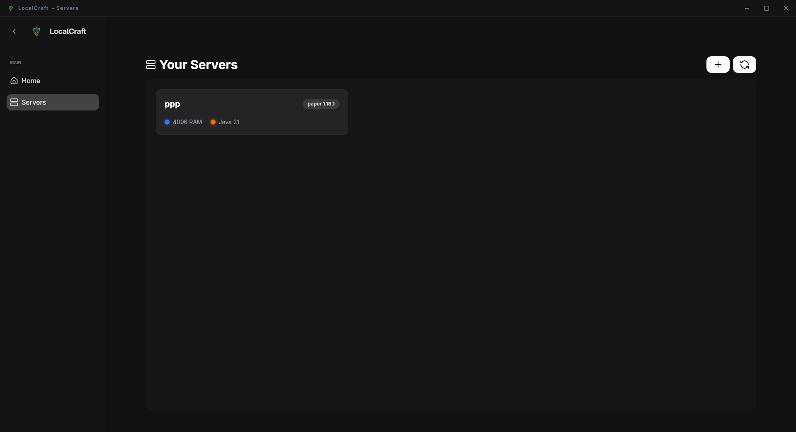
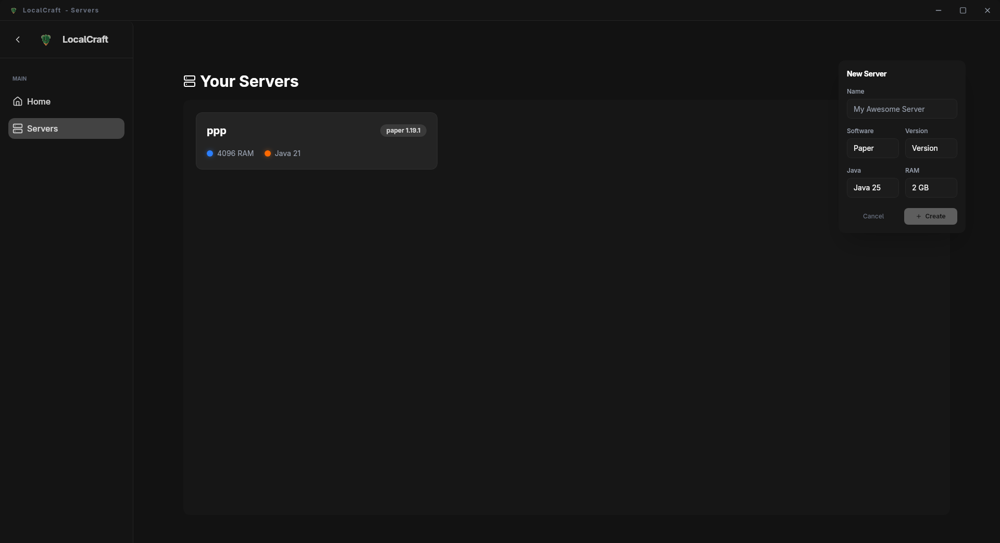

# 🏗️ LocalCraft - Vue Edition

<div align="center">
  
  <p align="center">
    <strong>A high-performance, modern Minecraft server manager built with Tauri and Vue.</strong>
  </p>

  [](https://github.com/your-username/localcraft-vuew)
  [](LICENSE)
  [](#)
</div>

## ✨ Introduction

LocalCraft is a desktop application designed to simplify the process of hosting and managing Minecraft servers locally. Leveraging the power of **Tauri** for a lightweight backend and **Vue 3** for a sleek, responsive UI, it provides a premium experience for both casual players and power users.

## 🚀 Características Actuales

- **Gestión de Java**: Detección y descarga automática de diferentes versiones de JRE.
- **Creación de Servidores**: Wizard intuitivo para configurar software (Vanilla, Paper, Fabric, etc.) y versiones.
- **Interfaz Moderna**: Animaciones fluidas con GSAP y diseño minimalista.
- **Multi-plataforma**: Compatible con Linux, Windows y macOS gracias a Tauri.

## 🗺️ Roadmap

Esta es nuestra hoja de ruta para alcanzar la versión 1.0.

### ✅ Completado
- [x] Estructura base con Tauri and Vue 3.
- [x] Sistema de gestión de Java (Java Manager).
- [x] Interfaz de creación de servidores (`ServerCreateModal`).
- [x] Panel principal de visualización de servidores.

### 🚧 En Desarrollo / Próximamente
- [ ] **Manejo del Ciclo de Vida del Servidor**:
  - [ ] Botones de Iniciar, Detener y Reiniciar.
  - [ ] Estado del proceso (Running/Stopped).
- [ ] **Consola en Tiempo Real**:
  - [ ] Stream de logs directamente desde el proceso del servidor.
  - [ ] Input de comandos hacia la consola.
- [ ] **Gestor de Archivos**:
  - [ ] Explorador de archivos integrado.
  - [ ] Editor de texto para archivos `.properties`, `.yml`, `.json`.
- [ ] **Sección de Mods/Plugins**:
  - [ ] Integración con la API de **Modrinth**.
  - [ ] Integración con la API de **CurseForge**.
  - [ ] Instalación con un solo clic.
- [ ] **Distribución en Flathub**:
  - [ ] Compilación y empaquetado para Linux via Flatpak.
  - [ ] Publicación en la tienda oficial de Flathub.

---

## 📸 Galería de Imágenes

A continuación, se muestran los componentes clave de la aplicación:

| Componente | Captura de Pantalla |
| :--- | :--- |
| **Panel de Control** |  |
| **Creación de Servidor** |  |
| **Configuración de Java** | (Próximamente) |
---

## 🛠️ Tech Stack

- **Frontend**: [Vue 3](https://vuejs.org/) + [Vite](https://vitejs.dev/) + [TypeScript](https://www.typescriptlang.org/)
- **Styling**: Vanilla CSS / Scoped CSS
- **Backend/Native**: [Tauri](https://tauri.app/) (Rust)
- **Animations**: [GSAP](https://greensock.com/gsap/)
- **Icons**: SVG Internos + Lucide-Vue

## 📦 Instalación (Desarrollo)

Para ejecutar el proyecto localmente:

1.  **Clonar el repositorio:**
    ```bash
    git clone https://github.com/your-username/localcraft-vuew.git
    ```
2.  **Instalar dependencias:**
    ```bash
    bun install
    ```
3.  **Ejecutar en modo dev:**
    ```bash
    bun tauri dev
    ```

---

<div align="center">
  Hecho con ❤️ por Moisés Marenco Vives
</div>
